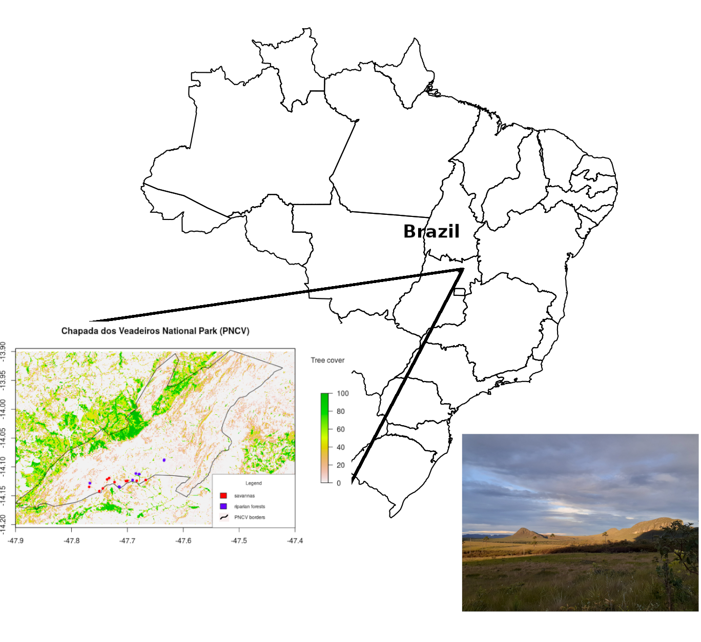
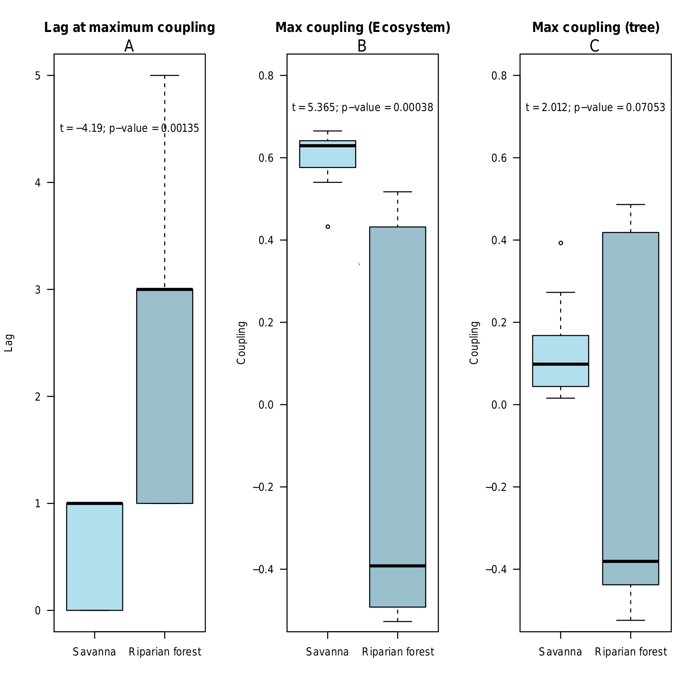
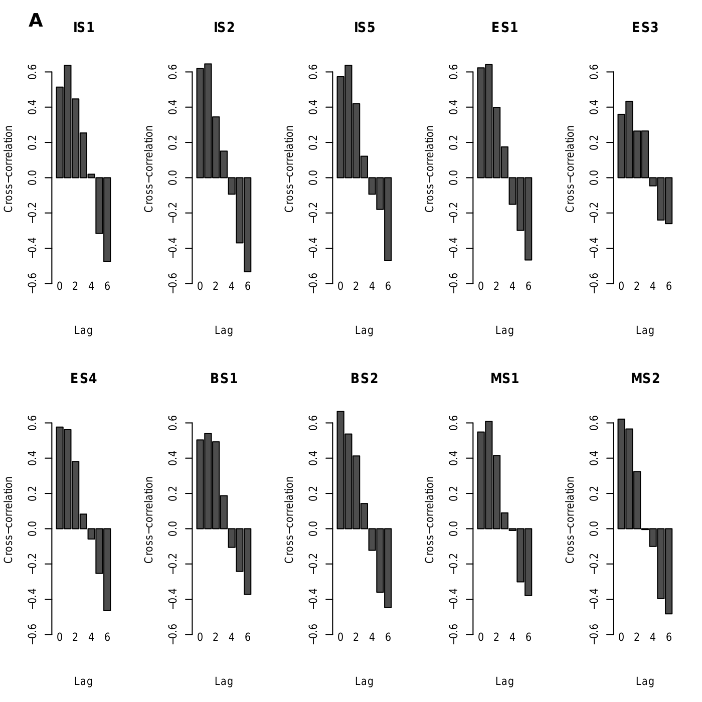
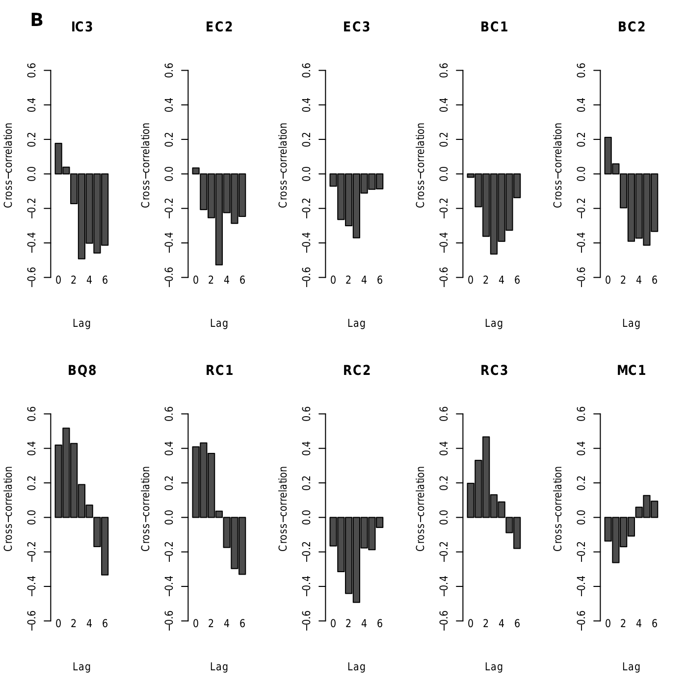
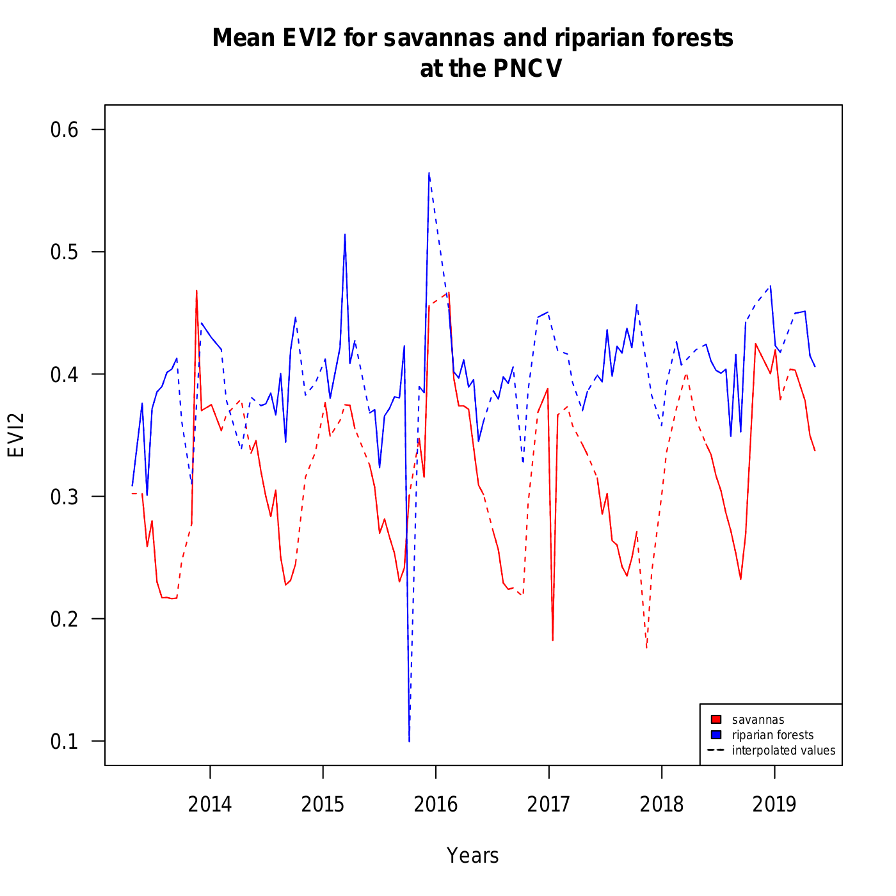

  
```{r setup, include=FALSE}
knitr::opts_chunk$set(echo = TRUE)
```
### Abstract

Under the current change in precipitation regime, carbon balance in the tropics may be impacted through responses of drought-threatened vegetation in terms of gross primary productivity (GPP). We aim to understand how forests and savannas under the same precipitation regime respond in terms of GPP to rainfall seasonality. We hypothesize that savannas respond faster to precipitation by changing their GPP inferred through the EVI2, particularly when the woody and herbaceous layer are included. We sampled tree cover in savannas and in riparian evergreen forests, at the Chapada dos Veadeiros National Park (PNCV), located within the Cerrado biome, in Brazil. We calculated the coupling between time series of both EVI2 from Landsat8 and the monthly precipitation calculated from CHIRPS dataset. Forests and savannas respond differently to rainfall seasonality. We found that maximum coupling in savannas is greater than in forests. However, when quantifying only the contribution of tree coverage of both ecosystems, savannas and forests have similar responses. Nonetheless, savannas respond faster than forests to rainfall. Our results indicate that forests and savannas at the PNCV are functionally distinct because of the differences in the response time of forest and savanna to rainfall seasonality.

**Key-words:** 

\newpage

## 1. Introduction
  
  Ecosystem functions such as the gross primary productivity (GPP) depend on the interactions that emerge from biodiversity and its environment [@Costanza2007]. For example, drought extremes may negatively affect GPP in the tropics [@YUAN2021]. In the tropics, where precipitation and fire regimes allow the existence of forests and savannas [@Hirota2011; @Staver2011; @Accatino2013], there are heterogeneous distribution of water availability related to plant distribution patterns [@Ferreira2007], such as those found in the Brazilian Cerrado. Vegetation is extremely dynamic and may change to an alternative state if submited to a gradual change (or an anomalous pulse event) that may exceed its self organizing capacity [@VanNes2014]. Forests and open environments may also represent alternative functional states, regarding, for example, tree height [@Xu2015]. In this way, these alternative structural states may be also functionally distinct [@Charles-Dominique2015; @Yin2014; @Berdugo2017] and consequently present distinct responses to changes in environmental drivers, such as those related to precipitation variability [@Schwartz2020].
  
   Systems exposed to a more variable environment may have a higher self-organization capacity [@Holling1973]. For example, studies have shown that forests submitted to a higher rainfall variability are more resistant to drought events [@Barros2019; @Ciemer2019]. Current studies on the coupling between drought (e.g. SPI) and vegetation indices (e.g. NDVI, EVI as photosintetic efficiency) generally focus on large scale patterns, and only in forest and not in savanna ecosystems (e.g. [@Lotsch2003]). It is also known that the coupling may be more pronounced for arid or semi-arid regions [@Ding2007; @Chen2019; @Chen2020], and that water use efficiency and hydrological resilience is greater for drier areas [@Xue2020]. Locally, responses to precipitation variability in terms of greenness may depend on the vegetation type [@Chen2020]. Therefore, understanding how distinct vegetation types respond in terms of GPP to rainfall variability is fundamental to capture how savannas and forest dynamics may be affected by extreme precipitation events. However, this discussion still lacks information on how forests and savannas under the same precipitation regime respond to rainfall seasonality in terms of GPP.
  
  Based on the combination of satellite data and field sampling, this study aims at investigating such responses. We hypothesize that the distinct ways savannas and forests respond to rainfall seasonality affect the overall ecosystem functioning in terms of productivity.

\pagebreak

## 2. Materials and Methods

  We performed our study at the Chapada dos Veadeiros National Park (PNCV) (Figure 1), located within the Cerrado biome, in Brazil. We choose the PNCV because its landscapes are heterogeneous, and thus present various phytophysiognomies (e.g. cerrado *stricto sensu*, riparian evergreen forests, dry forests, palm swamps, grasslands) characterized by a wide range of tree coverages, all within the same large-scale precipitation regime.
  
  The large-scale rainfall regime at PNCV features mean annual precipitation of around 1400 mm/year and a marked dry seadon of around 5 to 6 months.




### 2.1. Sample plots

  We sampled a total of 20 (200m²) field plots, from which 10 were located in cerrado *stricto sensu* physiognomy (savanna) and 10 in riparian forests (Figure 1). The sample efforts were performed in the end of the rainy season, in April, 2019. Plots were randomly selected according to classes of tree cover percentages from Hansen et al [-@Hansen2013]. Savannas are characterized by tree cover between 5 and 70%, whereas forests by tree cover higher than 70% [@Junior2014]. For each plot, we measured tree cover using a concave densiometer in all four plot corners, and for each corner the measurements were made in four directions (i.e. N, S, E, W). The resulted tree cover is the mean of all measured values (16 values) for each sample plot.

### 2.2. Satelite data

#### 2.2.1. EVI2

  We extracted the 2-band Enhanced Vegetation Index (EVI2, <https://www.indexdatabase.de/db/si-single.php?sensor_id=168&rsindex_id=237>): $$EVI2 = 2.4 (band 5 – band 4)/ (band 5 + band 4 + 1)$$ 
  
  from Landsat8 using the Tucumã tool [@Menini2019]. The EVI2 was developed to have the efficiency of EVI and avoid saturation at high biomass while minimizing atmosphere and soil influences without the blue band [@Jiang2008].
  
  The resolution of the data from Landsat8 is 30 x 30m, and is available for every 16 days. After filtering the EVI2 data using the quality flag file that contain information about the cloud mask for the scene (<http://www.landsat.usgs.gov>), we extracted the values for each sample plot and calculated the mean for each month from April, 2013 to June, 2018.
  
   Overall riparian evergreen forests sampled at the PNCV have a narrow width and long extensions as they occur along streams. Consequently, some bias may impact the EVI2 results once the Landasat8 image pixel size is more than 3-times our sample plots size.

#### 2.2.2. Precipitation 

  We also downloaded a daily time series of precipitation with approximated 5 x 5 km resolution from the CHIRPS dataset (<https://data.chc.ucsb.edu/products/CHIRPS-2.0/>), extracted the time series for each sample plot and calculated the mean for each month.

### 2.3. Coupling between EVI2 and precipitation

  We defined the coupling using the Kendall tau, calculated as the correlation between the EVI2 and precipitation time series for each sample plot. In savannas where trees and grasses co-exist [@Scholes1997], we calculated two coupling values: 1) ecosystem value, accounting for both tree and grass coverage; and 2) tree cover value, performing an standardization according to the measured tree cover to account only for the effect savanna trees have on the EVI2.

  We also investigated the lag that the maximum correlation between EVI2 and precipitation occurs for each sample plot, using a cross-correlation function analysis.

  We performed a Student's t-test to compare the coupling of forests and savannas and to compare the coupling of trees from both ecosystems. All analyses were performed with R 3.6 [@R2020].

```{r acoplamenta, echo=FALSE}
dados<-read.table("./dados")

t1 <- t.test(dados$Coup_max_ecosys ~ dados$Fitofisionomia)
t2 <- t.test(abs(dados$Coup_max_ecosys) ~ dados$Fitofisionomia)

t3 <- t.test(dados$Coup_max_trees ~ dados$Fitofisionomia)
t4 <- t.test(abs(dados$Coup_max_trees) ~ dados$Fitofisionomia)

t5 <- t.test(dados$Ecosys_Coup ~ dados$Fitofisionomia)
t6 <- t.test(abs(dados$Ecosys_Coup) ~ dados$Fitofisionomia)

t7 <- t.test(dados$Trees_Coup ~ dados$Fitofisionomia)
t8 <- t.test(abs(dados$Trees_Coup) ~ dados$Fitofisionomia)

t9 <- t.test(dados$Lag_max ~ dados$Fitofisionomia)

testeTtable <- matrix(c(t1[1:3],
           t2[1:3],
           t3[1:3],
           t4[1:3],
           t9[1:3]), byrow=T, ncol = 3)
rownames(testeTtable) = c("Ecosys","Ecosys (abs)","Trees","Trees (abs)","Lag at max coup")
                  colnames(testeTtable) = c("t", "df", "p-value")

```
testTtable
  
## 3. Results

  We found distinct responses to precipitation for forests and savannas at the PNCV (Figure 3; Table 1). Maximum coupling between productivity and precipitation for savannas is greater than for forests (t=5.365, p=0.00038) (Figure 3b). When considering only trees in both ecosystems, we also found distinct responses (t=2.012, p=0.07) (Figure 3c) regarding 1) the greater variation and 2) the negative coupling values in forest responses. Furthermore, savannas respond faster than forests (t=-4.1912, p=0.001357) with the time lag spanning from 0 to 1 month (Figure 3a; Figure 4). The maximum coupling for forests lags 2.5 months on average, with a minimum of 1 and a maximum of 5 months. Although tree-max-coupling is in general similar (t=2.012, p=0.07; Figure 3c), negative maximum coupling values for forests indicate that decreases in precipiation occur with increases in productivity (Figure 4b; Figure 5). On the other hand, in savannas, maximum coupling is overall positive (Figure 4a; Figure 5). Furthermore, the coupling magnitude (i.e. absolute values) is also greater for savannas (ecosystem level) (Table 1), but when considering only trees, forest trees present a higher absolute coupling value than savannas (Table 1). 



   ||Mean coupling for forests|Mean coupling for savannas|t|df|p-value¹|
|---:|:---:|:-----:|:---:|:-----:|:-----|
|Ecosystem|-0.1606064|0.6006385|-5.36525|9.438804|0.0003855732\*|
|Ecosystem (abs²)|0.4437516|0.6006385|-4.692693|17.64299|0.0001906804\*|
|Trees|-0.1481870|0.1300121|-2.0126|10.48863|0.07053421|  
|Trees (abs²)|0.4178408|0.1300121|6.212402|15.84881|1.297914e-05\*|
|Lag at maximum coupling|2.5 months|0.7 month|4.1912|11.553|0.001357\*|
[¹] \*  Significant values; [²] absolute values meaning the strongest of the coupling.

Table 1: Student's t test comparing coupling between greeness and precipitation  for forests and for savannas at the PNCV.







## 4. Discussion

  Our results show that the relationship between precipitation and productivity for savannas and riparian forests at the PNCV differs substantially.

  As a general ecosystem function, GPP, is likely to be an emergent property resulting from the interactions of several elements. GPP depends on the water and light availability [@Hillel2004], further on other resources and environmental conditions, such as solar radiation [@Monteith1972], nutrient availability [@Vries2014], soil toxicity [@Fisher2020], temperature [@Allen2015], and topography [@Chen2020].

 Riparian forests at the PNCV present an increasing greening during the dry season (Figure 5). The negative maximum coupling for most forest plots and the largest mean lag suggest that forests increase their productivity during and after the dry season and potentially after anomalous droughts. It may be explained by the higher evaporative demand from the atmosphere when the temperatures are higher because of the large-scale air subsidence (leading to lower relative humidity) combined with the proximity of the water table in riparian evergreen forests. These kind of response were reported before for tropical forests [@Huete2006; @Saleska2007; @Wu2016], with a potential explanation linked to the trade-off between drought-avoidance and drought-tolerance in which larger trees would have more access to deep waters than smaller ones, but they would also be more vulnerable to embolism than smaller trees [@Brum2018]. It is not the case here, because riparian evergreen forests and savannas are submitted to different conditions (e.g. soil characteristics, water availability) in different environments due to the heterogeneity of the landscape. Water is not a limiting resource for the riparian forests at the PNCV because they are close to the water table and thus have water access throughout the year. The reasoning to explain the positive responses to decreased precipitation may be related to deciduousness [@Ouedraogo2016].
 
 On the other hand, for Amazonian trees, the ontogeny of leaves are linked to photosynthetic efficiency where leaf turnover patterns may be crucial in explaining similar evergreen forest productivity during dry seasons [@Albert2018]. Furthermore, sunlight may be more available during the dry season (given the air subsidence), and clouds may act as a negative factor to control GPP in the wet season. Another plausible explanation, still to be tested is that the productivity of the riparian forests may be affected by the precipitation regime occurring on the water springs, outside the borders of the PNCV. Therefore, our results may indicate a possible causal relation between the time of response and the connectivity with environments submitted to distinct precipitation regimes.
  
  We presume that the competition for light is as important for forest trees as is water for savanna trees based on the forest greening during the dry season. Our results point to the existence of a trade-off between distinct strategies [@Brum2018]. For instance, severe droughts may imply more vulnerability for heigher trees due to the increasing tension in the water column with increasing tree height [@Koch2004; @Ryan1997]. Furthermore, the higher the trees the higher the energy costs to rebuild xylem after the occurrence of embolisms [@Trugman2018]. On the other hand, tree size (i.e. diameter at breast height) is an indicator of root deepth, which would allow for the use of deep water and its redistribution when the surface is dry. Moreover, traits related to root depth are good predictors of vegetation responses to precipitation changes [@Zhang2020]. 

According to our hypothesis, savannas are more reponsive to precipitation seasonality than forests. In savannas the critical resource is water, so trees have mechanisms to avoid loss of water and hydraulic failure, such as stomatal control [@Skelton2015a]. Furthermore, there are other environmental filters acting on the systems. For example, soil organic carbon content combined with granulometry may influence water retention [@Rawls2003]. Variation in water and air permeability is also influenced by soil structure with lower variation occuring in sandy soils [@Iversen2001]. Fine soil granulometry is an indicator of high adsorption of water and nutrients because the smaller the particle size, the more the contact surface and the higher the cation exchange capacity [@Hillel2004]. As the proportion of evergreen trees are lower for savannas, deciduousness may also control water loss, and trees may contribute to a lower variability in the ecosystem greenness through redistribution mechanisms [@Priyadarshini2016].

Further studies should be performed to reproduce our methods and to test hydraulic and fire traits as explanatory variables to the coupling. 

## 5. Conclusions

  Quantitative and mechanistic understanding of plant-communities' responses to precipitation is of major importance to better predict vegetation losses.
  Our results indicate that the GPP may depend on the proximity of the water table at the PNCV. Furthermore, forests at the PNCV present increasing growth during the dry season such as reported for some Amazonian forests. However, further studies are necessary to understand which mechanisms are driving the patterns found here. Therefore, forests and savannas at the PNCV are functionally distinct, in agreement with structural differences they present, particularly taking into account the differences in the response time and coupling variation between forest and savanna communities.
  
## References

::: {#refs}
:::

